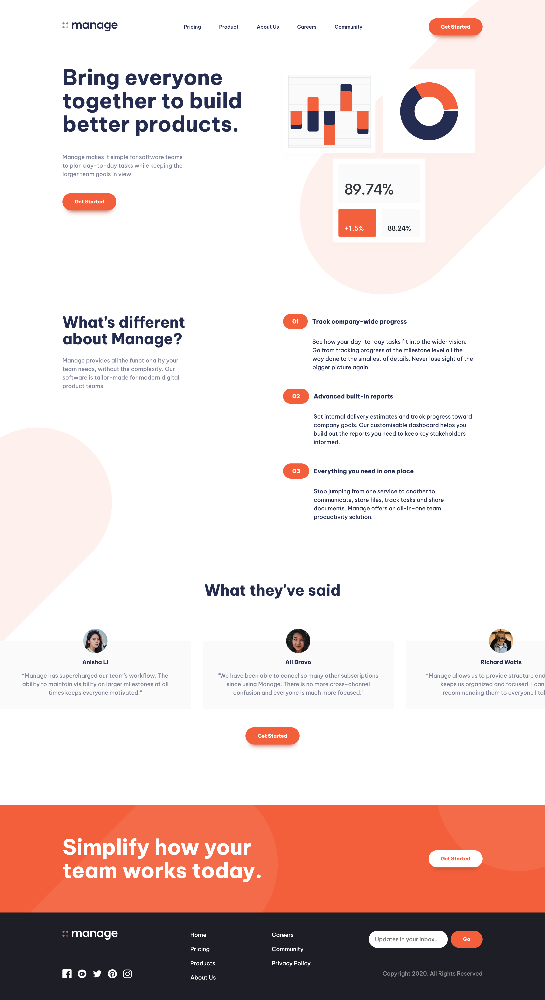
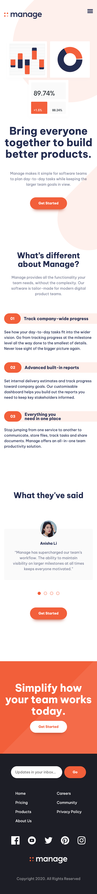

# Frontend Mentor - Manage landing page solution

This is a solution to the [Manage landing page challenge on Frontend Mentor](https://www.frontendmentor.io/challenges/manage-landing-page-SLXqC6P5). Frontend Mentor challenges help you improve your coding skills by building realistic projects. 

## Table of contents

- [Overview](#overview)
  - [The challenge](#the-challenge)
  - [Screenshot](#screenshot)
  - [Links](#links)
- [My process](#my-process)
  - [Built with](#built-with)
  - [What I learned](#what-i-learned)
- [Author](#author)
- [Acknowledgments](#acknowledgments)

## Overview

### The challenge

Users should be able to:

- View the optimal layout for the site depending on their device's screen size
- See hover states for all interactive elements on the page
- See all testimonials in a horizontal slider

### Screenshot

### Links

- Solution URL: (https://github.com/viveqgupta/manage-landing-page-viveq)
- Live Site URL: (https://manage-landing-page-viveq.netlify.app/)

## My process

### Built with

- Semantic HTML5 markup
- CSS custom properties
- Flexbox
- CSS Grid

### What I learned

"I have acquired a plethora of knowledge, including advancements in Flexbox and Grid layouts, as well as various nuanced properties within HTML and CSS. I extend my gratitude to Frontend Mentor for affording me the invaluable opportunity to deepen my understanding and refine my skills in these domains."

### Continued development

"I am eager to enhance my proficiency in CSS and HTML. While I have grasped the fundamentals, I am driven to delve deeper into these languages through continuous learning and deliberate practice. My aspiration is to refine my skills, broaden my understanding, and cultivate expertise in crafting elegant and efficient web designs. I am committed to embracing challenges and exploring advanced concepts to elevate my capabilities in CSS and HTML development."

## Author

- Github - [@viveqgupta](https://www.your-site.com)
- Frontend Mentor - [@viveqgupta](https://www.frontendmentor.io/profile/viveqgupta)
- Twitter - [@viveqgupta](https://www.twitter.com/viveqgupta)

## Acknowledgments

I have created this project with guidance from Kevin Powell's YouTube channel. As I am still in the process of learning JavaScript, I utilized some of his code. I am grateful for his teaching, which has introduced me to many new concepts and significantly enhanced my understanding.
